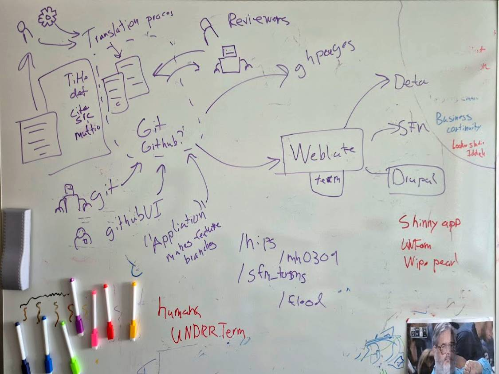

# PreventionWeb Term

> **Alpha proof of concept** as of 16 March 2026. Under active development and testing. Breaking changes will happen, and not all data is loaded yet.
>
> The live site is gated behind a preview PIN: **5498**. Enter it once per browser session to access the pages.

Multilingual terminology for the UN Office for Disaster Risk Reduction, managed as markdown files in git. Terms compile to JSON for Weblate translation workflows and get published as a static site.



## What it does

- One markdown file per concept. All languages sit together in YAML frontmatter.
- Compiles to flat JSON for Weblate (self-hosted)
- Builds a static site with Eleventy and UNDRR's Mangrove design system
- Syncs both directions between markdown and Weblate, so you can edit in either place

## Term projects

| Project | Folder | Description |
|---------|--------|-------------|
| Hazard Information Profiles | `terms/hips/` | Hazard definitions from the 2025 HIPs (~281 terms) |
| Sendai Framework Terminology | `terms/sendai/` | DRR concepts and definitions (~282+ terms) |

Languages: Arabic, Chinese, English, French, Russian, Spanish (with support for additional languages over time).

## Prerequisites

- [Node.js](https://nodejs.org/) 18 or later
- [Yarn](https://classic.yarnpkg.com/) 1.x (`npm install -g yarn` if you don't have it)

## Getting started

```bash
yarn install
yarn compile          # markdown → JSON
yarn dev              # local dev server (Eleventy)
yarn build            # full build (compile + site)
```

### Other scripts

```bash
yarn import:weblate   # pull translations back from Weblate JSON into markdown
```

## Import / Export

Terms can be exported to CSV or JSON for offline editing, bulk review, or exchange with external systems, then imported back. All scripts are idempotent — exporting and re-importing produces no changes.

### Export

```bash
yarn export:csv               # all projects → exports/{project}.csv
yarn export:csv hips          # single project
yarn export:csv hips --output terms.csv
yarn export:csv hips --lang zh          # English + Chinese only
yarn export:csv hips --lang zh,fr       # English + Chinese + French

yarn export:json              # all projects → exports/{project}.json
yarn export:json hips         # single project
yarn export:json hips --output terms.json
yarn export:json hips --lang zh         # English + Chinese only
```

The `--lang` flag filters the export to the source language (English) plus the specified target(s). This makes the output smaller and easier to work with for translators reviewing a single language pair. The import scripts accept any subset of languages — columns or translations not in the file are left untouched.

**CSV format** is wide: one row per term with columns for metadata (`code`, `id`, `project`, `status`, `category`, `domain`, `related`) followed by each language's fields (`{lang}_term`, `{lang}_definition`, `{lang}_context`, `{lang}_part_of_speech`, `{lang}_aliases`, `{lang}_source_text`, `{lang}_source_url`, `{lang}_confidence`). Aliases and related terms are pipe-separated (e.g., `Hurricane|Typhoon`).

**JSON format** is hierarchical with project metadata, a language list, and a `terms` array where each entry contains the full translation object as it appears in frontmatter.

### Import

```bash
yarn import:csv <file.csv>    # CSV → markdown frontmatter
yarn import:json <file.json>  # JSON → markdown frontmatter
```

Both import scripts update existing terms and create new ones. The expected formats match what the export scripts produce — export a project, edit the file, then import it back.

#### Creating new terms

When importing new terms (codes that don't already exist), the import scripts auto-generate fields you leave blank:

| Field | Auto-generated from |
|-------|---------------------|
| `id` | English term name, slugified (e.g., "Disaster risk reduction" → `disaster-risk-reduction`) |
| `slug` | Same as `id` |
| `status` | Defaults to `draft` |

If the English term contains only non-Latin characters (e.g., Arabic, Chinese), `id` falls back to the `code` value.

The minimum you need to provide for a new term is `code`, `project`, and an English term + definition. See `tests/fixtures/template-new-terms.csv` and `tests/fixtures/template-new-terms.json` for starter templates.

### Excel

A lightweight converter turns `.xlsx` files into CSV for import. It requires the `xlsx` package, which is installed on demand:

```bash
yarn add xlsx                         # one-time setup
yarn xlsx-to-csv data.xlsx            # → data.csv (first sheet)
yarn xlsx-to-csv data.xlsx out.csv    # explicit output path
yarn xlsx-to-csv data.xlsx --sheet "Terms"  # specific sheet
```

Typical workflow: `xlsx → csv → import:csv`.

### Sample fixtures

`tests/fixtures/` contains sample CSV and JSON files that can be used to verify the pipeline:

- `sample-import.csv` / `sample-import.json` — round-trip test data (existing terms)
- `template-new-terms.csv` / `template-new-terms.json` — starter templates showing the minimum fields for new terms (auto-ID generation)

```bash
bash tests/test-import-export.sh   # round-trip + auto-ID smoke tests
```

This exports all terms, re-imports them, and verifies the output is identical. It also imports the sample fixtures, tests auto-ID generation from the templates, and confirms no leftover files.

## How terms are structured

Each term is a markdown file in `terms/{project}/`. Filenames use the source system code (e.g., `mh0301.md` for flood). All translations live in the frontmatter. Definitions support inline markdown (bold, italic, links).

```yaml
---
id: flood
code: mh0301
slug: flood
project: hips
status: published
category: hydrological
domain: natural-hazards/meteorological
related:
  - flash-flood
  - coastal-flood
translations:
  en:
    term: Flood
    definition: >
      The overflowing of the normal confines of a *stream*
      or other body of water...
    part_of_speech: noun
    context: "The 2011 Thailand flood caused $45.7 billion in damages."
    aliases:
      - Flooding
    source:
      text: "UNDRR, 2017"
      url: "https://www.undrr.org/publication/..."
  fr:
    term: Inondation
    definition: Le débordement des limites normales...
    part_of_speech: nom
    source:
      text: "UNDRR, 2017"
      url: "https://www.undrr.org/publication/..."
  # ... ar, zh, ru, es
---
```

When a term needs images or extended descriptions, it becomes a folder:

```
terms/hips/gh0001/
  index.md              # frontmatter with short definitions
  description_en.md     # extended narrative (English)
  description_fr.md     # extended narrative (French)
  fault-mechanics.svg   # diagram referenced in descriptions
```

See [METHODOLOGY.md](METHODOLOGY.md) for design rationale, prior art, and the Weblate sync workflow.

## Frontmatter reference

### Concept-level fields

| Field | Required | Description |
|-------|----------|-------------|
| `id` | yes | Unique identifier for the concept (e.g., `flood`) |
| `code` | yes | Source system code, used as filename and in URLs (e.g., `mh0301`) |
| `slug` | yes | Human-readable slug for display purposes |
| `project` | yes | Which term project this belongs to (`hips`, `sendai`) |
| `status` | yes | Publication state: `published`, `draft`, or `retired` |
| `domain` | no | Hierarchical domain path (e.g., `natural-hazards/meteorological`). Must have a matching entry in `site/src/_data/i18n.json` for translated display. |
| `category` | no | Sub-classification within the domain (e.g., `hydrological`) |
| `related` | no | List of `id` values for related concepts |

### Per-language fields (under `translations.{lang}`)

| Field | Required | Description |
|-------|----------|-------------|
| `term` | yes | The term in this language |
| `definition` | yes | Short definition. Supports inline markdown (`*italic*`, `**bold**`, `[links](url)`). |
| `part_of_speech` | no | Grammatical category in the target language (e.g., `noun`, `nom`, `اسم`) |
| `context` | no | Example sentence or usage note in the target language |
| `aliases` | no | List of alternative names in this language |
| `source.text` | no | Human-readable citation (e.g., `UNDRR, 2017`) |
| `source.url` | no | URL to the source document |
| `confidence` | no | Translation quality tier (1–5): 1=Machine, 2=Draft, 3=Reviewed, 4=Verified, 5=Authoritative. Reviewer metadata — not sent to Weblate. |

## Repository layout

```
terms/          Markdown term files, one per concept
weblate/        CI-generated JSON for Weblate (do not edit by hand)
scripts/        Build, import, and export scripts
  lib/          Shared utilities (term loading, CSV parsing)
site/           Eleventy static site
exports/        Generated CSV/JSON exports (git-ignored)
tests/          Smoke tests and sample fixtures
```

## License

Code (scripts, templates, config) is Apache License 2.0. Content (terminology data) is Creative Commons Attribution 4.0 IGO. See [LICENSE](LICENSE).
