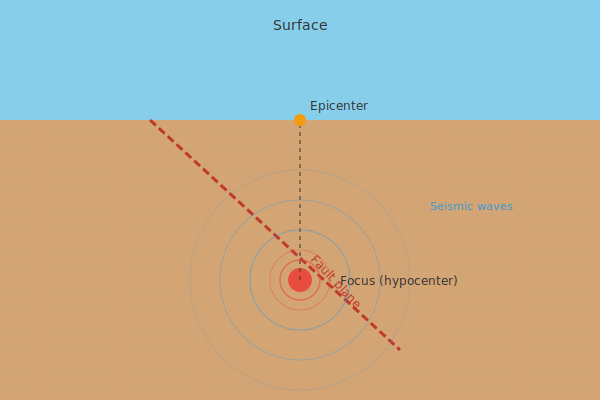

## Diagram

Simplified diagram showing the relationship between the focus (hypocenter),
epicenter, and seismic wave propagation along a fault plane.

## Measurement

Earthquake magnitude is measured using the moment magnitude scale (Mw),
which replaced the Richter scale for most scientific purposes. Intensity
is assessed using the Modified Mercalli Intensity Scale (MMI), which
describes observed effects at specific locations.
